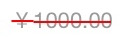

# 8.3Bug解决、学习资料整理
[TOC]
##Bug

###加载缓存逻辑，无网打开应用无缓存，置后台再进入会显示缓存，无网提示不会消失

###删除线的绘制

存在的问题：
1. 右边显示过短（**通过添加高度为1的UIView解决**）
2. 金额前的￥与数字上的删除线未对齐（错误￥正确¥）

###未使用自动布局时label宽度的自适应

##Ooooother
[iOS应用架构谈-网络层设计方案](http://casatwy.com/iosying-yong-jia-gou-tan-wang-luo-ceng-she-ji-fang-an.html)

##学习资料整理
[学习资料整理](https://github.com/yanqizhao/dev-note/blob/August/August/学习资料整理.md)

