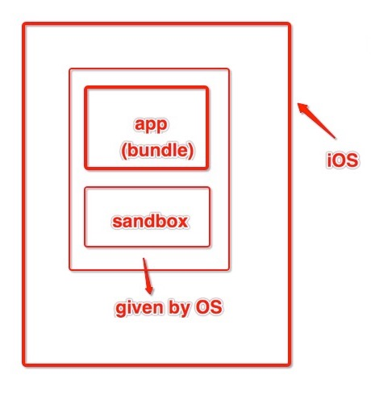

# 8.9资源载入方式

[TOC]

> 写在前面，我的问题不是图片是通过imageNamed还是imageWithContentsOfFile加载进入的区别，也不是沙盒的路径怎么读取。

## 一直没搞明白的assets和直接拖入的资源

平时加载图片的时候无非是两种方式，一种是把图片放入assets里，会自动识别2x、3x，另一种是直接拖入工程里，这两种方式都会跟随代码一同打包成为app的一部分，解压来看的话，前者可以直接在包内看到，后者需要把.car的资源读取出来才能看到，但是本质都是一样的，就是作为应用包的一部分，安装在手机上后占据该应用大小的一部分。

## 从沙盒中读取图片

如果我需要把资源从网络上下载下来存进沙盒来使用的话，就是完全不同的了，沙盒就像是手机为每款应用分配的额外的存储空间，大家各自使用，不能乱来。（越狱的别来打我）

> 哇哇，朋友画了一张图，应该可以说清楚了

## 关于沙盒的一些资料

[iOS8之后的动态沙盒路径](http://www.jianshu.com/p/20692cf1af33)

[资源加载方式-这个解决了我的问题](http://www.cnblogs.com/asnowTT/archive/2012/05/08/2490466.html)
 
[资源存放位置-这个解释了前言中的问题](http://www.jianshu.com/p/85a44d28986f)

[iOS沙盒目录详解](http://www.jianshu.com/p/dd3f120eb249)

