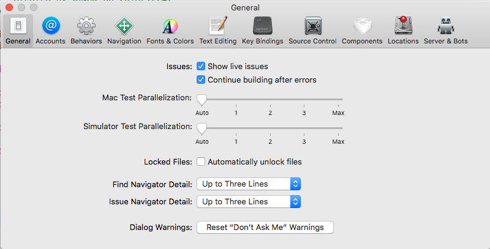

# Xcode快捷键与工具栏使用

[Xcode使用帮助](https://help.apple.com/xcode/mac/10.1/)


```
A target specifies a product to build, such as an iOS, macOS, tvOS, or watchOS app.
A scheme is a collection of settings that specify the targets to build, the build configuration, and the executable environment. 
```

## 偏好设置

偏好设置的第一项为`General`，通用设置。

`Show live issues`表示是否需要Xcode实时检测文件中的错误
`Continue building after errors`表示编译发现错误时是否要继续，如果想要将错误发现一个改正一个的时候可以勾选，如果想要通过一次编译找出所有错误就不要勾选
`Mac Test Parallelization`
`Simulator Test Parallelization`
`Locked Files`是否自动锁定文件，在使用很多三方库时会发现他们都被上了锁
`Find Navigator Detail`
`Issue Navigator Detail`





