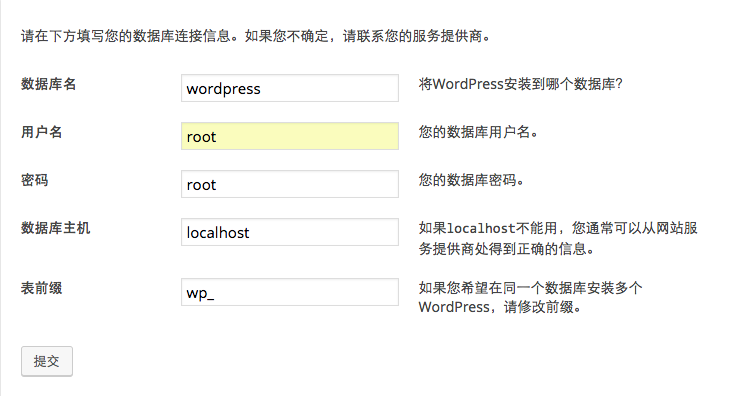

# 如何搭建个人博客（使用阿里云的域名与WordPress建站）

开篇先放个教程，不给教程的博主不是好孩子。

[弹性Web托管快速入门](https://help.aliyun.com/document_detail/29844.html?spm=5176.7739903.6.551.PsQBSj)

断断续续折腾了一个多月，总算是有一个可以看的博客了，可惜此刻的我已然离职，与当初认真记录工作学习内容而建站的初衷有所违背啊。

从开始完全不懂要做什么，到现在还是什么都不懂，但也算是在各种教程与朋友的帮忙下搞定了。

首先要先说一下搭建个人博客为什么要买域名和服务器，突然想到一个很好的解释。就好比你要写一本书给别人看，那么首先你需要给你的书起一个名字，与其他书可以区分开的名字，那不就是ISBN(International Standard Book Number)嘛，在个人博客中就相当于域名，你购买了这个域名，别人就不能拿来使用。那么有了书名以后，为了能发行给读者，你是不是还需要联系一个出版社来帮你印刷呢，这就相当于虚拟主机，你要把你个人博客中的文字内容、图片资源等一系列的stuff存在虚拟主机上，由它来帮你呈现这一切。至于你想要怎样排版你书的页面，就可以通过更换主题、安装插件等一系列方法实现了。

我是在阿里云购买的域名，经过了一个月的漫长备案，之后买了弹性Web托管，然后被搞得一头雾水。假设你已经买好域名和虚拟主机，域名备案也已经完成后，接下来该做什么呢。

首先要做的是将虚拟主机绑定到域名上，然后再进行域名解析。这里使用写书的例子好像就不太合适了，在知乎上看到一个解释感觉不错，你可以把域名当做你的手机SIM卡，里面包含了你的手机号等信息，为了能够使用这张卡，你不得不买了一个手机，那么这时，你把手机卡放进手机的行为就相当于主机绑定域名，当然你可以在这个虚拟主机中绑定多个域名，就像手机可以双卡双待一样。如下图这样，我这里其实只是一个域名，那么你可以理解为我给自己的手机号起了一个别名，就像小号一样。

而域名解析又是在做什么呢？我的理解是，当你把SIM卡放进手机后，手机读取芯片并识别出这个卡号以及卡中存放的电话号码、信息等内容的过程就是域名解析。

也就是说，当你想要通过手机来确定号码时，你需要主机绑定域名，而想要通过号码确定所使用的手机时，则需要域名解析。

[弹性Web托管如何绑定域名](https://help.aliyun.com/knowledge_detail/39881.html)  
[弹性Web托管如何解析域名](https://help.aliyun.com/knowledge_detail/39903.html)

到此，在浏览器地址栏输入你的域名就可以成功访问了。
等等，为什么我看到的是这样的网站。。

因为你的博客中还空空荡荡的什么都没有，将你的网站数据上传到之前购买的虚拟主机后才能看得到，可以按照下方的帮助文档操作。

[弹性Web托管如何上传网站程序？](https://help.aliyun.com/knowledge_detail/39915.html)

这里我使用了WordPress，就是所谓的五分钟安装，将一些需要配置的内容通过可视化的界面呈现给你，在第一次使用WordPress安装时可以访问`http://你的域名/wp-admin/install.php`来操作，在这里输入你购买主机中的信息，获取信息的方式如下：

[如何获取弹性Web托管的应用信息？](https://help.aliyun.com/knowledge_detail/39916.html)

网站数据上传好了，后台数据库也配置好，现在总该可以访问了吧，还差一步。。
这里你的默认首页还没有更换，将`zhuye.html`删除并保存设置即可。

现在就可以愉快的访问了，这里是我的博客地址[琦乐无穷的小蘑菇](http://yanqizhao.cn)

以后再需要进行各种配置请访问这里`http://你的域名/wp-login.php`

最后，这里是我参考过的几篇文章。

[5分钟 搭建免费个人博客](http://www.jianshu.com/p/4eaddcbe4d12)  
[手把手教你使用Hexo + Github Pages搭建个人独立博客](https://linghucong.js.org/2016/04/15/2016-04-15-hexo-github-pages-blog/)  
[WordPress个人建站之路](http://www.jianshu.com/p/ffcd53b99055)  

